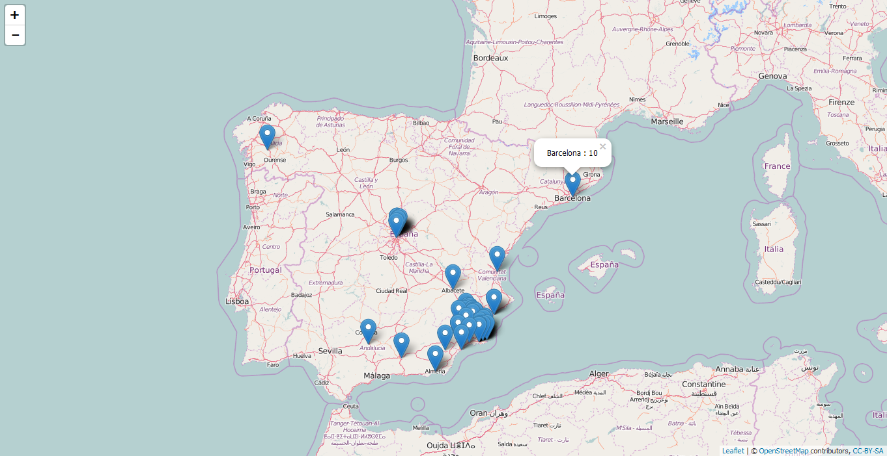

## Trabajo a realizar

Es de gran interés para el departamento de marketing de una empresa conocer en que regiones es más popular y en cuales no. Esta información se puede obtener de Twitter, ya que permite conocer la localización de los followers.

El objetivo de este trabajo es crear una función que tome como único input el nombre de un usuario de Twitter (p.ej. "UPCTnoticias"). La funcion encontrará todos los followers de este usuario y generará un mapa en el que se muestre su localización:

## Paquetes recomentados

* `twitteR`: para extraer datos de Twitter.
* `ggmap`: para extraer la latitud y longitud de cada localización.
* `leaflet`: para generar el mapa.
