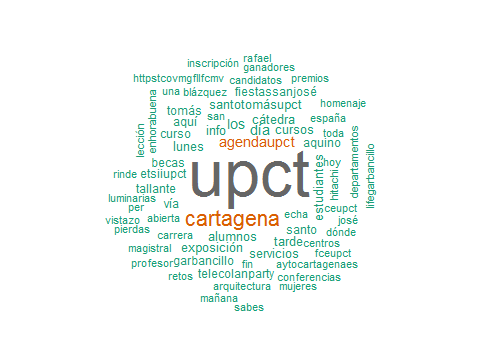

## Trabajo a realizar

Una nube de palabras es un gráfico en el que se muestran las palabras más utilizadas en un documento o un conjunto de documentos, proporcionando una primera idea sobre su contenido.

En esta tarea se utilizará una colección de tweets para crear una nube de palabras como la de la siguiente figura:

## Paquetes recomendados

* tm
* wordcloud

