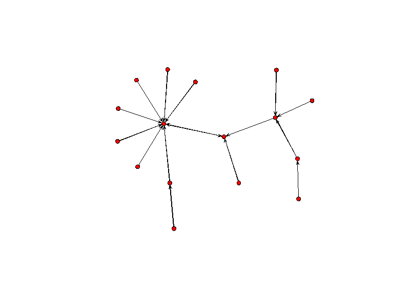

## Objetivos

El sistema de followers de Twitter permite estudiar las relaciones entre los diferentes usuarios. A partir de estas relaciones se pueden realizar diversos estudios como, por ejemplo, qué usuarios son los mas influyentes dentro de una red.

Un _network graph_ muestra a cada usuario como un vértice y las relaciones entre ellos como flechas. Esto permite tener una primera impresión de las relaciones entre ellos.

## Paquetes sugeridos

* rjson
* network
